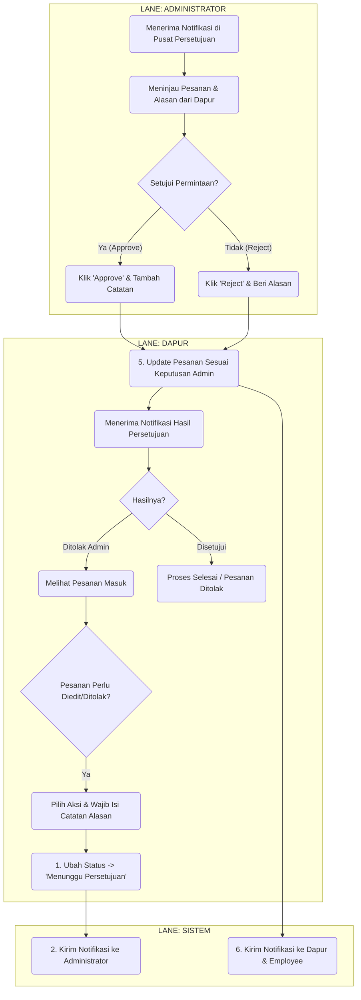

Tentu, saya akan buatkan diagram alur kerja (workflow) untuk aplikasi **Bebang Pack Meal Portal**.

Untuk memberikan gambaran yang paling jelas, saya akan membaginya menjadi dua bagian:

1.  **Diagram Alur Kerja Utama:** Menjelaskan proses "happy path" dari pesanan dibuat hingga selesai.
2.  **Diagram Alur Kerja Pengecualian:** Menjelaskan proses ketika Dapur menolak atau mengedit pesanan, yang memerlukan persetujuan Administrator.

---

### **1. Diagram Alur Kerja Utama (Proses Pesanan Standar)**

Diagram ini menunjukkan alur normal sebuah pesanan tanpa ada penolakan atau editan.

**Aktor/Peran yang Terlibat:**
*   **Employee:** Karyawan yang memesan.
*   **Sistem:** Aplikasi Bebang Pack Meal Portal.
*   **Dapur:** Staf yang menyiapkan makanan.
*   **Delivery:** Staf yang mengantar makanan.

```mermaid
graph TD
    subgraph "LANE: EMPLOYEE"
        A1(Mulai: Login ke Aplikasi) --> A2{Membuat Pesanan Baru <br> (Pilih Shift & Jumlah)};
        A2 --> S1;
        S2 --> A3(Menerima Notifikasi: <br> Pesanan Diproses);
        S4 --> A4(Menerima Notifikasi: <br> Pesanan Siap Diambil Delivery);
        S6 --> A5(Menerima Notifikasi: <br> Pesanan Sedang Diantar);
        S8 --> A6(Menerima Notifikasi: <br> Pesanan Selesai);
        A6 --> A7(Selesai);
    end

    subgraph "LANE: SISTEM"
        S1(1. Membuat Pesanan <br> Status: 'Menunggu') --> S2(2. Kirim Notifikasi <br> ke Dapur);
        S3(3. Update Status -> 'In Progress' <br> & Kirim Notifikasi ke Employee) --> S4(4. Update Status -> 'Ready' <br> & Kirim Notifikasi ke Delivery);
        S5(5. Update Status -> 'On Delivery' <br> & Kirim Notifikasi ke Employee) --> S6(6. Kirim Notifikasi <br> ke Employee);
        S7(7. Update Status -> 'Complete') --> S8(8. Kirim Notifikasi Selesai <br> ke Employee);
    end

    subgraph "LANE: DAPUR"
        B1(Melihat Daftar Pesanan Masuk) --> B2{Terima Pesanan?};
        B2 -- Ya --> B3(Mengubah Status -> 'In Progress');
        B3 --> S3;
        B3 --> B4(Menyiapkan Pack Meal);
        B4 --> B5(Mengubah Status -> 'Ready');
        B5 --> S4;
    end

    subgraph "LANE: DELIVERY"
        C1(Melihat Daftar Pesanan 'Ready') --> C2(Pickup Pesanan dari Dapur);
        C2 --> C3(Mengubah Status -> 'On Delivery');
        C3 --> S5;
        C3 --> C4(Mengantar Pesanan ke Divisi);
        C4 --> C5(Mengubah Status -> 'Complete');
        C5 --> S7;
    end

    %% Flow Connections
    S2 --> B1;

```

**Penjelasan Alur Kerja Utama:**
1.  **Employee** membuat pesanan baru.
2.  **Sistem** menyimpannya dengan status `Menunggu` dan memberi notifikasi ke **Dapur**.
3.  **Dapur** menerima pesanan, mengubah statusnya menjadi `In Progress`.
4.  **Sistem** mengupdate status dan memberi notifikasi ke **Employee**.
5.  Setelah makanan siap, **Dapur** mengubah status menjadi `Ready`.
6.  **Sistem** mengupdate status dan memberi notifikasi ke **Delivery**.
7.  **Delivery** mengambil pesanan dan mengubah status menjadi `On Delivery`.
8.  **Sistem** mengupdate status dan memberi notifikasi ke **Employee**.
9.  Setelah pesanan diantar, **Delivery** mengubah status menjadi `Complete`.
10. **Sistem** mengupdate status dan memberitahu **Employee** bahwa proses telah selesai.

---

### **2. Diagram Alur Kerja Pengecualian (Proses Persetujuan Admin)**

Diagram ini dimulai ketika Dapur memutuskan untuk menolak atau mengedit pesanan yang masuk.

**Aktor/Peran yang Terlibat:**
*   **Dapur:** Staf yang memulai proses penolakan/edit.
*   **Sistem:** Aplikasi yang mengelola alur persetujuan.
*   **Administrator:** Pengguna yang memiliki hak untuk menyetujui/menolak.



**Penjelasan Alur Kerja Pengecualian:**
1.  **Dapur** menerima pesanan tetapi menganggapnya tidak wajar atau perlu diubah.
2.  **Dapur** memilih aksi (Tolak/Edit) dan **wajib** mengisi formulir alasan/catatan.
3.  **Sistem** secara otomatis mengubah status pesanan menjadi `Menunggu Persetujuan` dan mengirim notifikasi ke **Administrator**.
4.  **Administrator** melihat permintaan ini di menu "Pusat Persetujuan".
5.  **Administrator** meninjau detailnya dan membuat keputusan:
    *   **Jika Disetujui (Approve):** Permintaan Dapur (penolakan atau editan jumlah) akan diterapkan oleh sistem. Status pesanan akan diubah menjadi `Ditolak` atau jumlahnya diperbarui.
    *   **Jika Ditolak (Reject):** Permintaan Dapur dibatalkan. Status pesanan akan dikembalikan oleh sistem ke `Menunggu`, sehingga pesanan tersebut kembali ke antrian Dapur untuk diproses seperti biasa.
6.  **Sistem** kemudian mengirimkan notifikasi hasil keputusan kepada **Dapur** dan **Employee** yang bersangkutan.